## Packages utilizados no projeto

- [DRF](https://www.django-rest-framework.org/)
- [DRF Paginagion](https://www.django-rest-framework.org/api-guide/pagination/)
- [DRF JWT](https://django-rest-framework-simplejwt.readthedocs.io/en/latest/getting_started.html)
- [DRF Renderers](https://www.django-rest-framework.org/api-guide/renderers/)
- [DRF-YASG (Swagger)](https://drf-yasg.readthedocs.io/en/stable/readme.html)
- [Python Decouple](https://github.com/henriquebastos/python-decouple)
- [Django Cors Headers](https://pypi.org/project/django-cors-headers/)
- [Faker](https://faker.readthedocs.io/en/master/)

## Coisas a fazer usuário

- Adicionar e configurar Nginx.
- Adicionar e configurar Redis.
- Adicionar e configurar Docker.
- Adicionar restrição de máximo e mínimo nas transferências.
- Poder pagar contas.
- Começar a desenvolver o agendamento de transferências, pagamento de contas, etc.
- Integração com API que traz as contas de água, luz, telefone, etc.
- Integração com o FPDS.
- Pagamento/Transferência com 2 passos de autenticação.
- Gravar dispositivo que entrar no sistema.

## Coisas a fazer ADM da aplicação
- Conseguir ver uma listagem de todas as transações.
- Editar e alterar dados de qualquer usuário.
- Ver o histórico de transações de um usuário expecifico.


## Entendendo a aplicação e algumas peculiaridades.

- Crie um arquivo .env e nele deve conter algumas variáveis de sistema:
```
DEBUG=False
SECRET_KEY=Colocar a secrety key aqui
ALLOWED_HOSTS=[127.0.0.1, localhost]
EMAIL_PORT = porta do seu provedor de email
EMAIL_HOST = host do seu provedor de email
EMAIL_HOST_USER=usuario do seu provedor de email
EMAIL_HOST_PASSWORD=senha do seu provedor de email
FRONTEND_URL = Endereço da sua aplicação
APP_SCHEME = Endereço do seu aplicativo mobile
```

- Crie um virtual enviroment, ative o mesmo e utilize o seguinte comando para instalar as dependência do projeto. `pip install -r requirements.txt`

#### DRF Renderers
- Utilizado para criar response customizadas reutilizáveis.
```python
from rest_framework import renderers
import json


class UserRender(renderers.JSONRenderer):
    charset = 'utf-8'

    def render(self, data, accepted_media_type=None, renderer_context=None):
        response = ''
        if 'ErrorDetail' in str(data):
            response = json.dumps({'errors': data})
        else:
            response = json.dumps({'data': data})

        return response
```
- Para utilizar basta ir na view que deseja usar e especificar a renderer class:
`renderer_classes = (UserRender,)`

#### DRF JWT
- Alteração do tempo de vida do token, por padrão é 5m do access token e 1 dia o refresh token [docs](https://django-rest-framework-simplejwt.readthedocs.io/en/latest/settings.html)
- Fiz uma pequena alteração para me ajudar no desenvolvimento.
```python
from datetime import timedelta
SIMPLE_JWT = {
    'ACCESS_TOKEN_LIFETIME': timedelta(minutes=50),
    'REFRESH_TOKEN_LIFETIME': timedelta(days=1)
}
```

#### DRF YASG
- Utilizado para ter essa UI bonitona, facilitando na parte da documentação da API, além de poder ir testando durando o desenvolvimento, sem precisar utilizar outros programas para consumir a API.

#### Python Decouple
- Utilizado para esconder pontos sensiveis do settings.py

#### Django Cors Headers
- Utilizado para que outros possam utilizar a minha API.
`CORS_ORIGIN_ALLOW_ALL = True`
- Também posso escolher para que apenas alguns possam utilizar a minha API.
```python
CORS_ORIGIN_WHITELIST = [
    "http://localhost:5000"
    "http://127.0.0.1:5000"
    "http://localhost:8000"
    "http://127.0.0.1:8000"
]
```

#### Custom Exception Handling.
- Em `core/settings.py` na chave `EXCEPTION_HANDLER` tem o caminho para o arquivo com as customizações das exceptions de: ValidationError, Http404, PermissionDenied e NotAuthenticated.
- Muito utilizado para se proteger de ataques contra a aplicação.
```python
REST_FRAMEWORK = {
      'EXCEPTION_HANDLER': 'utils.exceptionhandler.custom_exception_handler',
}
```
- Exemplo: Normalmente ao tentar acessar um endpoint com um usuário não logado iria receber `"detail": "Authentication credentials were not provided."`, porém agora utilizando o handle você irá receber `  "error": "Please login to proceed", "status_code": 401`, porém caso ainda queira alterar o status code, na linha 16 tem um exemplo.
- Em `core.urls`, tem os handlers de errors 404 e 500, ambos só funcionam se DEBUG estiver como False.


#### Custom Pagination Class
- Em `utils/custompagination.py` Existem algumas classes que alteram o `page_size` dos retornos.
- OBS: por padrão é configurado no `core.settings.py` na variável `REST_FRAMEWORK = {'PAGE_SIZE': 5,}`.

## Fluxo de criação de usuário e reset Password por email
- Enviando email para resetar a senha IMPORTANTE lembrar que se o email, existir ou não no banco de dados irá receber um success, dizendo que foi enviado o email, assim diminui as chances de pessoas mal intencionadas tentar forçar o sistema a resetar a senha dos outros.

- Criando um usuario:
- Erro customizado caso a senha não contenha apenas caracteres alphanumericos.
<br>
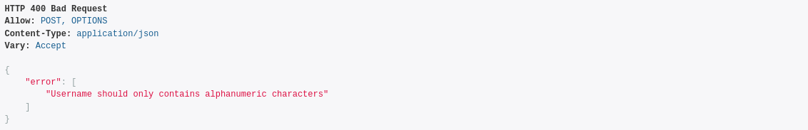 <br>

- Caso não haja erros o fluxo é este:
<br>
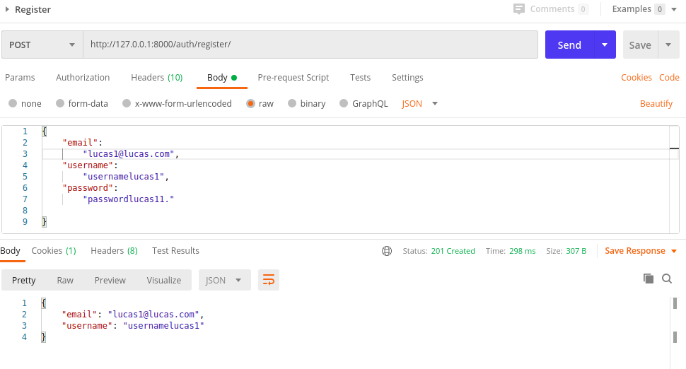 <br>

- Logo após criar um novo usuário você deve ativa-lo confirmando o email:
<br>
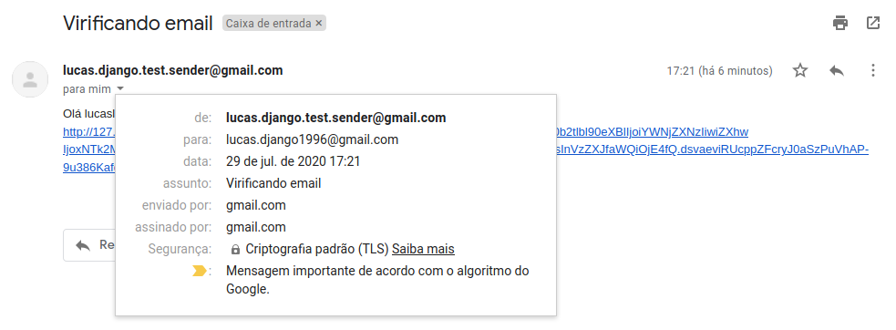 <br>
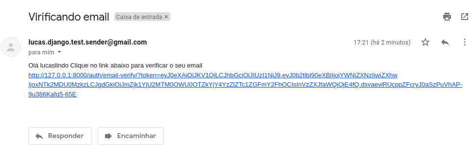 <br>

- Ao clicar no link irá receber um success:
<br>
 <br>
- Ou um erro dizendo que o link expirou:
<br>
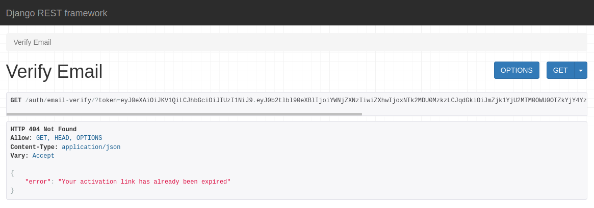 <br>

- Ao optar em resetar a senha, você irá receber um email com um link:
<br>
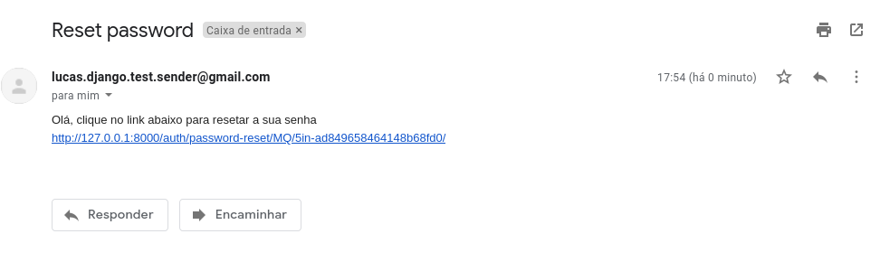 <br>
- Após clicar no link irá receber um success:
<br>
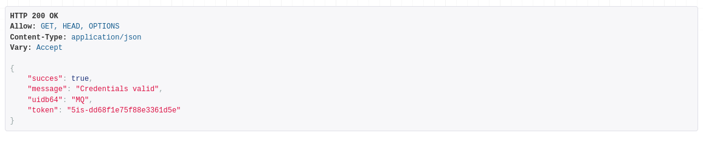 <br>
- Pode acontecer de demorar muito para receber/clicar e ele irá expirar:
<br>
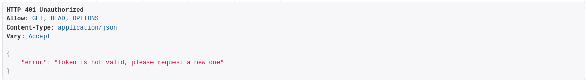 <br>

- Agora deve ser enviado um Patch com a nova senha, Uidb64 e o token:
<br>
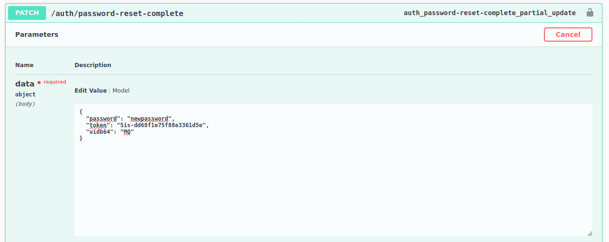 <br>
- Logo em seguida você irá ter a seguinte response:
<br>
 <br>
- Caso contrario irá receber dizendo que o token é invalido, caso já tenha expirado além dos outros erros base, por exemplo o da senha.
<br>
 <br>
  
## Logout usuário e Blacklist
- Toda a vez que um usuário fizer logout o token dele será enviado para o blacklist, impossibilitando que o mesmo token seja utilizado mais de uma vez.
  - JTI é o token; USER é o usuário; CREATED AT data do login; EXPIRES AT data do logout; BLACKLISTED AT data do blacklist; Sendo assim caso a pessoa for tentar relogar dentro de alguns segundos será possivel recriar a sessão.
<br>
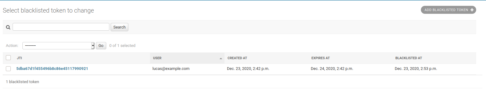 <br>
- Pode ser utilizado o commando `python manage.py flushexpiredtokens` para remover todos os items expirados da blacklist

## Pegar dados de um usuário logado
- Endpoint `/auth/user/` ao entrar, apenas mande um get nesse endpoint e era receber algo similar.
```json
{
  "id": 2,
  "email": "lucas@example.com",
  "username": "stringTav",
  "address": {
    "id": 19,
    "street_address": "string street",
    "city": "string city",
    "postal_code": 70707000,
    "country": "string cool"
  },
  "account": {
    "id": 16,
    "account_type": 1,
    "balance": "100.00",
    "account_no": 102,
    "gender": "M",
    "birth_date": "2021-01-08"
  }
}
```

## Redirecionamento (webhook) para frontend e/ou mobile apps
- Em `Authentication/views.py` você irá encontrar uma classe chamada de CustomRedirect onde está o scheme da app
- No endpoint /auth/request-reset-password/ existe um campo para redirecionar chamado redirect_url
<br>
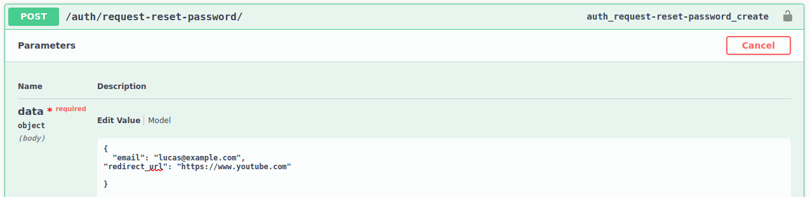 <br>
<br>
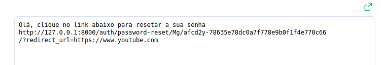 <br>
- Se for utilizado em um aplicativo mobile, deve ser utilizado em algo parecido com isto`"redirect_url": "yourmobileapplication://reset"`.
  - Deve ser exatamente igual à variável que está na allowed_schemes dentro da classe CustomRedirect
- Quando o usuário clicar irá ver algo parecido como este `https://www.frontenddomainsite.com/?token_valid=True&%3Fmessage=Credentials+valid&%3Fuidb64=Mg&%3Ftoken=afcd2y-78635e78dc0a7f778e9b0f1f4e770c66`
- Caso não seja informado nenhum link no campo não obrigatório redirect_url, será redirecionado para mim, dizendo que o token é invalido.

# Atualizar as informações de um usuário
- No endpoint `/auth/user-address-update/{id}/` é possível atualizar as seguintes informações:
```json
{
  "username": "string",
  "userAddress": {
    "street_address": "string",
    "city": "string",
    "postal_code": 0,
    "country": "string"
  }
}
```
- Caso tente alterar os dados de um usuário diferente do atual logado, irá receber o seguinte erro:
  - Possivel alterar essa permissão em: authentication/permissions.py
```json
{
  "errors": [
    "Permission denied"
  ],
  "status_code": 403
}
```

## BankAccountType
- Dentro do painel de administração do django em `/admin/authentication/bankaccounttype/add/` podem ser adicionados novos tipos de contas.
- Cada conta é obrigatório ter um nome e um valor máximo de saque.


## UserBankAccount
- Ao criar uma conta é automaticamente gerada um número de conta no settings.py é possível alterar o número de início `core/settings.py` váriavel `ACCOUNT_NUMBER_START_FROM`.
<br>
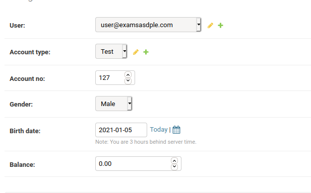
<br>
- Em `authentication/serializers.py` classe `RegisterSerializer` method `create` estou a somar o id do usuário com o número de início user.id+settings.ACCOUNT_NUMBER_START_FROM`  


# Transactions
- Informações sobre: Deposit(depositar), Withdrawal(retirar), Transfer(transferir).

IMPORTANTE: existe um arquivo em `transactions/constants` que tem o número identificador para cada transação. Exemplo: `"transaction_type": 1` que é DEPOSIT.

```python
DEPOSIT = 1
WITHDRAWAL = 2
TRANSFER_MONEY = 3
TRANSFER_MONEY_RECEIVED = 4

TRANSACTION_TYPE_CHOICES = (
    (DEPOSIT, 'Deposit'),
    (WITHDRAWAL, 'Withdrawal'),
    (TRANSFER_MONEY, 'TRANSFER_MONEY'),
    (TRANSFER_MONEY_RECEIVED, 'TRANSFER_MONEY_RECEIVED'),
)
```

## Deposit
- No endpoint `/transactions/deposit/ ` deposita um valor na conta do usuário.
<br>
  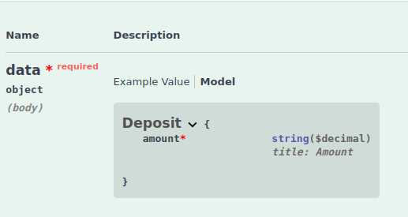
<br>
```json
{
  "amount": 0.00
}
```
- Em core/settings.py na variável `MINIMUM_DEPOSIT_AMOUNT` tem o valor mínimo para depósito.
<br>
  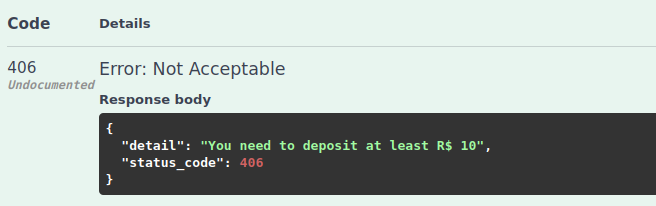
<br>
- Exemplo do retorno sucesso:
```json
{
  "data": {
    "account_id": 16,
    "balance_before_transaction": 160,
    "amount": 100.98,
    "balance_after_transaction": 260.98,
    "transaction_type": 1
  }
}
```

## Withdrawal
- No endpoint `/transactions/withdrawal/ ` saca um valor na conta do usuário.
- Só é possível sacar valores inteiros.
<br>
  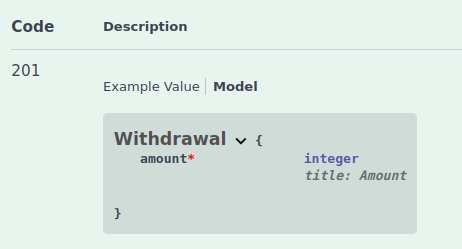
<br>
```json
{
  "amount": 0
}
```
- Em core/settings.py na variável `MINIMUM_WITHDRAWAL_AMOUNT` tem o valor mínimo para saque.
<br>
  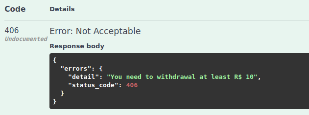
<br>
  
- Dependendo do tipo da sua conta existe um limite de saque `BankAccountType`.
<br>
  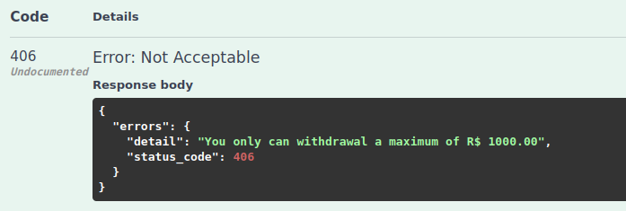
<br>

- Exemplo de retorno sucesso:
```json
{
  "data": {
    "account_id": 16,
    "balance_before_transaction": 260.98,
    "amount": 100,
    "balance_after_transaction": 160.98,
    "transaction_type": 2
  }
}
```

## Transfer
- No endpoint `/transactions/transfer/ ` transfere um valor conta do usuário para outra pessoa do mesmo banco.
- O campo user_name é o nome da pessoa que está logado no sistema.
<br>
  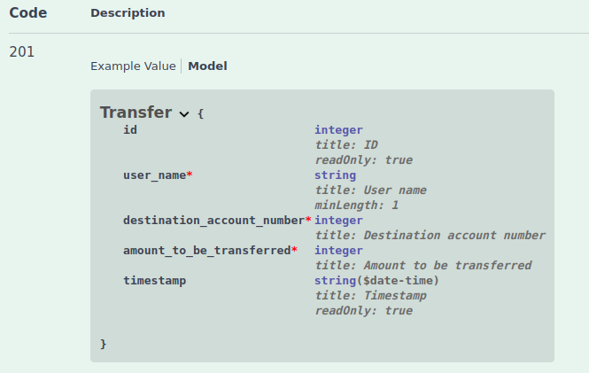
<br>
```json
{
  "user_name": "string",
  "destination_account_number": 0,
  "amount_to_be_transferred": 0
}
```
- Se o nome do usuário não for o mesmo da conta da pessoa logada:
<br>
  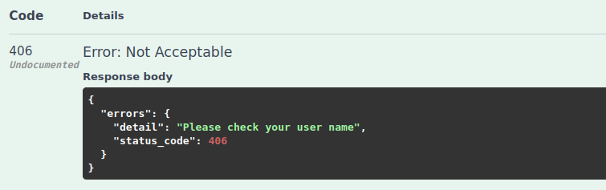
<br>
  
_ Se o valor da transferência for maior que o saldo da pessoa:
<br>
  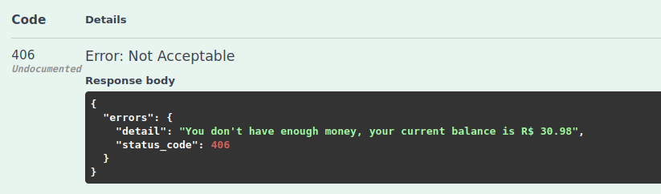
<br>
  
- Se o número da conta do destinatário não existir:
<br>
  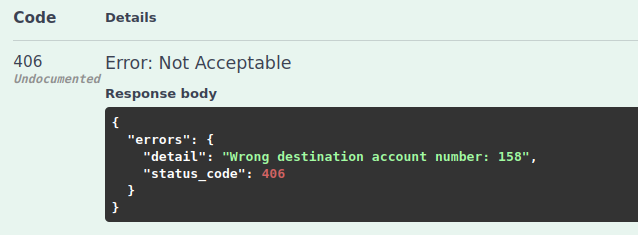
<br>
  
- Se o usuário tentar fazer uma transferência para ele mesmo:
<br
  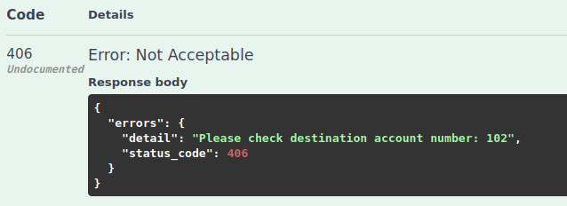
<br>

- Exemplo de retorno sucesso:
```json
{
  "data": {
    "username": "stringTav",
    "balance_before_transaction": 160.98,
    "amount": 100,
    "balance_after_transaction": 60.98,
    "destination_account_number": 130,
    "transaction_type": 3
  }
}
```
<br>
  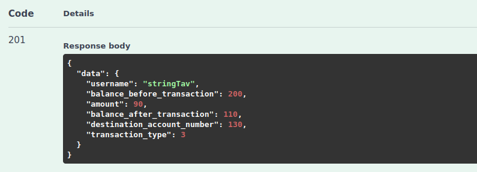
<br>

- Quem for o destinatário irá receber no seu report uma `"transaction_type": 4` que é TRANSFER_MONEY_RECEIVED.
```json
 {
    "id": 113,
    "account": 16,
    "timestamp": "2021-01-14T14:23:33.546297-03:00",
    "sender_name": "stringTav",
    "amount": "15.00",
    "balance_after_transaction": "260.98",
    "transaction_type": 4
  }
```

## Complete report
- No endpoint `/transactions/report/` traz todas as transações feitas do usuário.
- O campo `sender_user_name` é um campo para trazer o nome da pessoa que fez uma transferência.
  - Mudanças ainda podem ocorrer neste campo!
  - Apenas mostrar se for `"transaction_type": 4`
<br>
  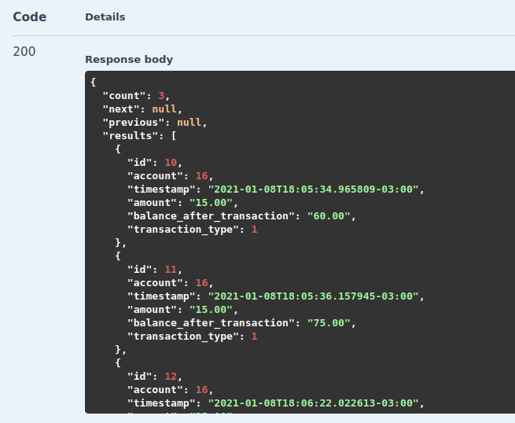
<br>
- Exemplo de retorno:
```json
{
  "count": 3,
  "next": null,
  "previous": null,
  "results": [
    {
      "id": 10,
      "account": 16,
      "timestamp": "2021-01-08T18:05:34.965809-03:00",
      "amount": "60.00",
      "balance_after_transaction": "60.00",
      "transaction_type": 1,
      "sender_user_name": ""
    },
    {
      "id": 11,
      "account": 16,
      "timestamp": "2021-01-08T18:05:36.157945-03:00",
      "amount": "15.00",
      "balance_after_transaction": "75.00",
      "transaction_type": 1,
      "sender_user_name": ""
    },
    {
      "id": 12,
      "account": 16,
      "timestamp": "2021-01-08T18:06:22.022613-03:00",
      "amount": "25.00",
      "balance_after_transaction": "100.00",
      "transaction_type": 1,
      "sender_user_name": ""
    }
  ]
}
```

## Report today
- No endpoint `/transactions/report/today/` traz o extrato mostrando as alterações feitas no dia.
<br>
  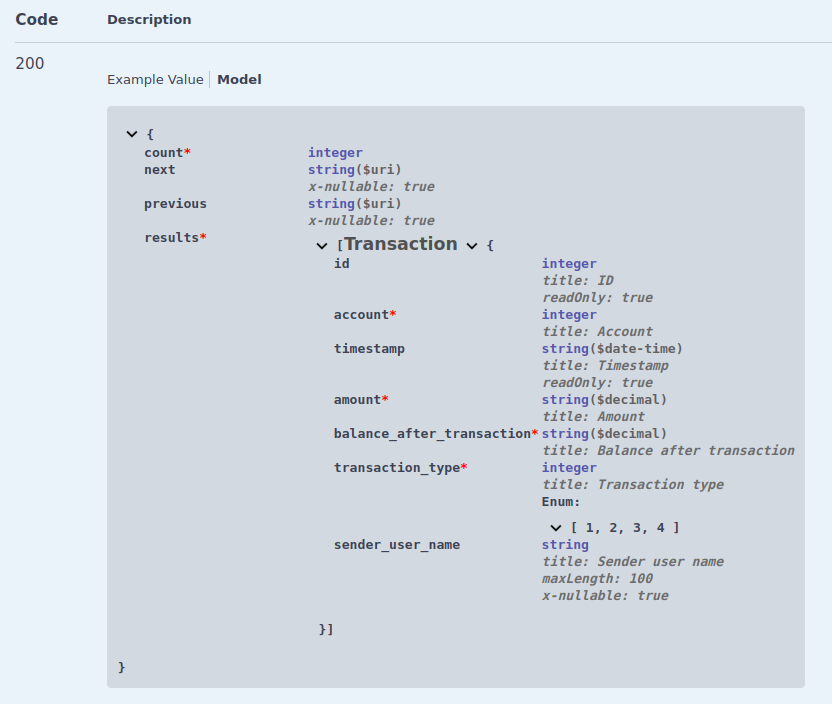
<br>
- Exemplo de retorno:
```json
{
  "count": 2,
  "next": null,
  "previous": null,
  "results": [
    {
      "id": 139,
      "account": 16,
      "timestamp": "2021-01-21T12:57:59.837122-03:00",
      "amount": "50.00",
      "balance_after_transaction": "380.98",
      "transaction_type": 2,
      "sender_user_name": ""
    },
    {
      "id": 138,
      "account": 16,
      "timestamp": "2021-01-21T12:57:51.110575-03:00",
      "amount": "100.00",
      "balance_after_transaction": "430.98",
      "transaction_type": 1,
      "sender_user_name": ""
    }
  ]
}
```

## Report with date range
- No endpoint `/transactions/report/{days}/ traz o extrato mostrando as alterações feitas conforme a quantidade de dias passados.
<br>
  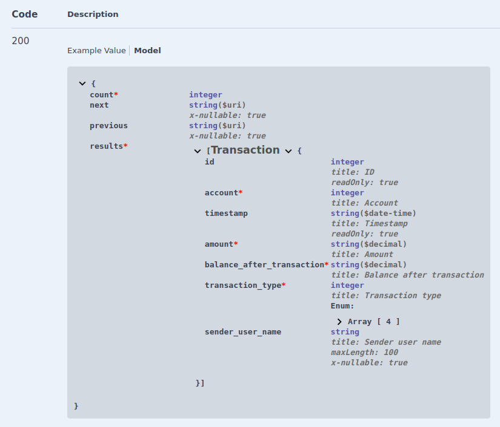
<br>

- Exemplo de retorno:
```json
{
  "count": 61,
  "next": "http://127.0.0.1:8000/transactions/report/10/?page=2",
  "previous": null,
  "results": [
    {
      "id": 139,
      "account": 16,
      "timestamp": "2021-01-21T12:57:59.837122-03:00",
      "amount": "50.00",
      "balance_after_transaction": "380.98",
      "transaction_type": 2,
      "sender_user_name": ""
    },
    {
      "id": 138,
      "account": 16,
      "timestamp": "2021-01-21T12:57:51.110575-03:00",
      "amount": "100.00",
      "balance_after_transaction": "430.98",
      "transaction_type": 1,
      "sender_user_name": ""
    },
    {
      "id": 137,
      "account": 16,
      "timestamp": "2021-01-14T15:50:32.923570-03:00",
      "amount": "100.00",
      "balance_after_transaction": "330.98",
      "transaction_type": 2,
      "sender_user_name": ""
    },
    {
      "id": 136,
      "account": 16,
      "timestamp": "2021-01-14T15:50:14.624025-03:00",
      "amount": "100.00",
      "balance_after_transaction": "430.98",
      "transaction_type": 2,
      "sender_user_name": ""
    },
    {
      "id": 135,
      "account": 16,
      "timestamp": "2021-01-14T15:48:18.757548-03:00",
      "amount": "100.00",
      "balance_after_transaction": "530.98",
      "transaction_type": 2,
      "sender_user_name": ""
    },
    {
      "id": 134,
      "account": 16,
      "timestamp": "2021-01-14T15:47:45.719898-03:00",
      "amount": "100.00",
      "balance_after_transaction": "630.98",
      "transaction_type": 2,
      "sender_user_name": ""
    },
    {
      "id": 133,
      "account": 16,
      "timestamp": "2021-01-14T15:46:34.660017-03:00",
      "amount": "100.00",
      "balance_after_transaction": "730.98",
      "transaction_type": 2,
      "sender_user_name": ""
    },
    {
      "id": 132,
      "account": 16,
      "timestamp": "2021-01-14T15:46:12.374900-03:00",
      "amount": "100.00",
      "balance_after_transaction": "830.98",
      "transaction_type": 2,
      "sender_user_name": ""
    },
    {
      "id": 131,
      "account": 16,
      "timestamp": "2021-01-14T15:45:22.812568-03:00",
      "amount": "100.00",
      "balance_after_transaction": "930.98",
      "transaction_type": 2,
      "sender_user_name": ""
    },
    {
      "id": 130,
      "account": 16,
      "timestamp": "2021-01-14T15:45:03.744015-03:00",
      "amount": "1000.00",
      "balance_after_transaction": "1030.98",
      "transaction_type": 1,
      "sender_user_name": ""
    }
  ]
}
```


## DashboardUser
- Total gasto baseado no cálculo de dias a traz, calcula o total por categoria /dashboard/expenses-category-sumary/{days}/ onde days é um número de dias.
<br>

<br>
- Total ganho baseado no cálculo de dias a traz /dashboard/incomes-source-sumary/{days}/ onde days é o número de dias.
<br>
- Lançamentos futuros /dashboard/expenses-coming-sumary/{days}/ onde days é o número de dias.
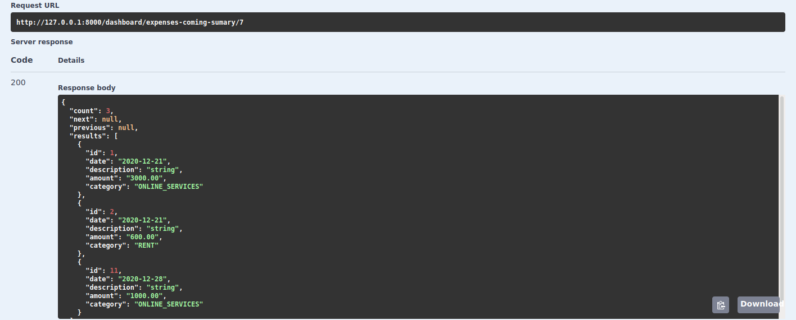
<br>

## Unit Testing Authentication
- Utilização do [Facker](https://faker.readthedocs.io/en/master/), para que seja gerado informações aleatórias facilitando a escrita dos testes.
- test_setup -> TestSetUp: Contém a base dos dados e as urls que tem testes criados
- test_view.py -> TestViews: Contém 4 testes simples de exemplo
