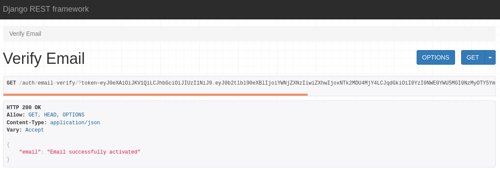
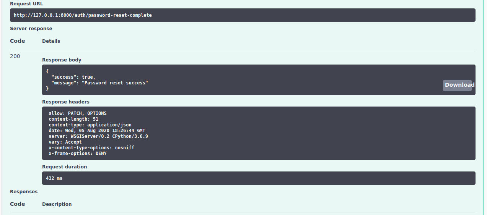

## Packages utilizados no projeto

- [DRF](https://www.django-rest-framework.org/)
- [DRF Paginagion](https://www.django-rest-framework.org/api-guide/pagination/)
- [DRF JWT](https://django-rest-framework-simplejwt.readthedocs.io/en/latest/getting_started.html)
- [DRF Renderers](https://www.django-rest-framework.org/api-guide/renderers/)
- [DRF-YASG (Swagger)](https://drf-yasg.readthedocs.io/en/stable/readme.html)
- [Python Decouple](https://github.com/henriquebastos/python-decouple)
- [Django Cors Headers](https://pypi.org/project/django-cors-headers/)
- [Faker](https://faker.readthedocs.io/en/master/)

## Coisas a fazer usuário

- Gerar um número único de conta.
- Suporte ao tipo de conta (Corrente, Poupança, etc)
- Salvar e editar os dados pessoais.
- Adicionar e configurar Nginx.
- Adicionar e configurar Redis.
- Adicionar e configurar Docker. 
- Depositar e retirar dinheiro.
- Ver as alterações do saldo a cada transação.
- Relatório de transação com um filtro de intervalo de datas.
- Adicionar restrição de máximo e mínimo nas transferências e pagamentos.
- Integração com API que traz as contas de água, luz, telefone e etc.
- Integração com o FPDS.
- Pagamento/Transferência com 2 passos de autenticação.

## Coisas a fazer ADM da aplicação
- Conseguir ver uma listagem de todas as transações.
- Editar e alterar dados de qualquer usuário.
- Ver o histórico de transações de um usuário expecifico.


## Entendendo a aplicação e algumas peculiaridades.

- Crie um arquivo .env e nele deve conter algumas variáveis de sistema:
```
DEBUG=False
SECRET_KEY=Colocar a secrety key aqui
EMAIL_PORT = porta do seu provedor de email
EMAIL_HOST = host do seu provedor de email
EMAIL_HOST_USER=usuario do seu provedor de email
EMAIL_HOST_PASSWORD=senha do seu provedor de email
FRONTEND_URL = Endereço da sua aplicação
APP_SCHEME = Endereço do seu aplicativo mobile

```

- Crie um virtual enviroment, ative o mesmo e utilize o seguinte comando para instalar as dependência do projeto. `pip install -r requirements.txt`

#### DRF Renderers
- Utilizado para criar response customizadas reutilizáveis.
```python
from rest_framework import renderers
import json


class UserRender(renderers.JSONRenderer):
    charset = 'utf-8'

    def render(self, data, accepted_media_type=None, renderer_context=None):
        response = ''
        if 'ErrorDetail' in str(data):
            response = json.dumps({'errors': data})
        else:
            response = json.dumps({'data': data})

        return response
```
- Para utilizar basta ir na view que deseja usar e especificar a renderer class:
`renderer_classes = (UserRender,)`

#### DRF JWT
- Alteração do tempo de vida do token, por padrão é 5m do access token e 1 dia o refresh token [docs](https://django-rest-framework-simplejwt.readthedocs.io/en/latest/settings.html)
- Fiz uma pequena alteração para me ajudar no desenvolvimento.
```python
from datetime import timedelta
SIMPLE_JWT = {
    'ACCESS_TOKEN_LIFETIME': timedelta(minutes=50),
    'REFRESH_TOKEN_LIFETIME': timedelta(days=1)
}
```

#### DRF YASG
- Utilizado para ter essa UI bonitona, facilitando na parte da documentação da API, além de poder ir testando durando o desenvolvimento, sem precisar utilizar outros programas para consumir a API.

#### Python Decouple
- Utilizado para esconder pontos sensiveis do settings.py

#### Django Cors Headers
- Utilizado para que outros possam utilizar a minha API.
`CORS_ORIGIN_ALLOW_ALL = True`
- Também posso escolher para que apenas alguns possam utilizar a minha API.
```python
CORS_ORIGIN_WHITELIST = [
    "http://localhost:5000"
    "http://127.0.0.1:5000"
    "http://localhost:8000"
    "http://127.0.0.1:8000"
]
```

## Fluxo de criação de usuário e reset Password por email
- Enviando email para resetar a senha IMPORTANTE lembrar que se o email, existir ou não no banco de dados irá receber um success, dizendo que foi enviado o email, assim diminui as chances de pessoas mal intencionadas tentar forçar o sistema a resetar a senha dos outros.

- Criando um novo usuario:
- Erro customizado caso a senha não contenha apenas caracteres alphanumericos.
<br>
 <br>

- Caso não haja erros o fluxo é este:
<br>
 <br>

- Logo após criar um novo usuário você deve ativa-lo confirmando o email:
<br>
 <br>
 <br>

- Ao clicar no link irá receber um success:
<br>
 <br>
- Ou um erro dizendo que o link expirou:
<br>
 <br>

- Ao optar em resetar a senha, você irá receber um email com um link:
<br>
 <br>
- Após clicar no link irá receber um success:
<br>
 <br>
- Pode acontecer de demorar muito para receber/clicar e ele irá expirar:
<br>
 <br>

- Agora deve ser enviado um Patch com a nova senha, Uidb64 e o token:
<br>
 <br>
- Logo em seguida você irá ter a seguinte response:
<br>
 <br>
- Caso contrario irá receber dizendo que o token é invalido, caso já tenha expirado além dos outros erros base, por exemplo o da senha.
<br>
 <br>
  
## Logout usuário e Blacklist
- Toda a vez que um usuário fizer logout o token dele será enviado para o blacklist, impossibilitando que o mesmo token seja utilizado mais de uma vez.
  - JTI é o token; USER é o usuário; CREATED AT data do login; EXPIRES AT data do logout; BLACKLISTED AT data do blacklist; Sendo assim caso a pessoa for tentar relogar dentro de alguns segundos será possivel recriar a sessão.
<br>
 <br>
- Pode ser utilizado o commando `python manage.py flushexpiredtokens` para remover todos os items expirados da blacklist

## Redirecionamento (webhook) para frontend e/ou mobile apps
- Em `Authentication/views.py` você irá encontrar uma classe chamada de CustomRedirect onde está o scheme da app
- No endpoint /auth/request-reset-password/ existe um campo para redirecionar chamado redirect_url
<br>
 <br>
<br>
 <br>
- Se for utilizado em um aplicativo mobile, deve ser utilizado em algo parecido com isto`"redirect_url": "yourmobileapplication://reset"`.
  - Deve ser exatamente igual à variável que está na allowed_schemes dentro da classe CustomRedirect
- Quando o usuário clicar irá ver algo parecido como este `https://www.frontenddomainsite.com/?token_valid=True&%3Fmessage=Credentials+valid&%3Fuidb64=Mg&%3Ftoken=afcd2y-78635e78dc0a7f778e9b0f1f4e770c66`
- Caso não seja informado nenhum link no campo não obrigatório redirect_url, será redirecionado para mim, dizendo que o token é invalido.

## DashboardUser
- Total gasto baseado no cálculo de dias a traz, calcula o total por categoria /dashboard/expenses-category-sumary/{days} onde days é um número de dias.
<br>

<br>
  
- Total ganho baseado no cálculo de dias a traz /dashboard/incomes-source-sumary/{days} onde days é o número de dias.
<br>
  
- Lançamentos futuros /dashboard/expenses-coming-sumary/{days} onde days é o número de dias.

<br>

## Unit Testing Authentication
- Utilização do [Facker](https://faker.readthedocs.io/en/master/), para que seja gerado informações aleatórias facilitando a escrita dos testes.
- test_setup -> TestSetUp: Contém a base dos dados e as urls que tem testes criados
- test_view.py -> TestViews: Contém 4 testes simples de exemplo
